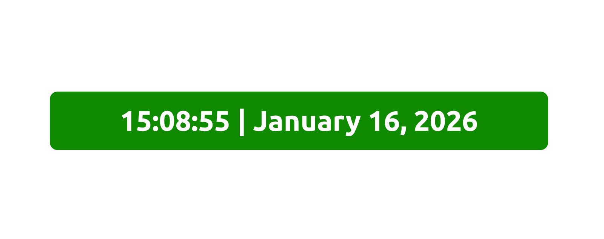

# Dynamic Color-Clock

## Description
This is a simple _React + Vite_ project that displays a dynamic colored clock with the current time and date.

## How to use :
1. Fork the repository.
2. Clone the repository;
   ```
   git clone <ssh-url>
   ```
3. Install dependencies using _npm_;
   ```
   npm install
   ```
4. Run the project;
   ```
   npm run dev
   ```
5. Open the local host provided in a browser then reload constantly to update the time.

Sould look like this;



## Author
**Jim Ochieng**
